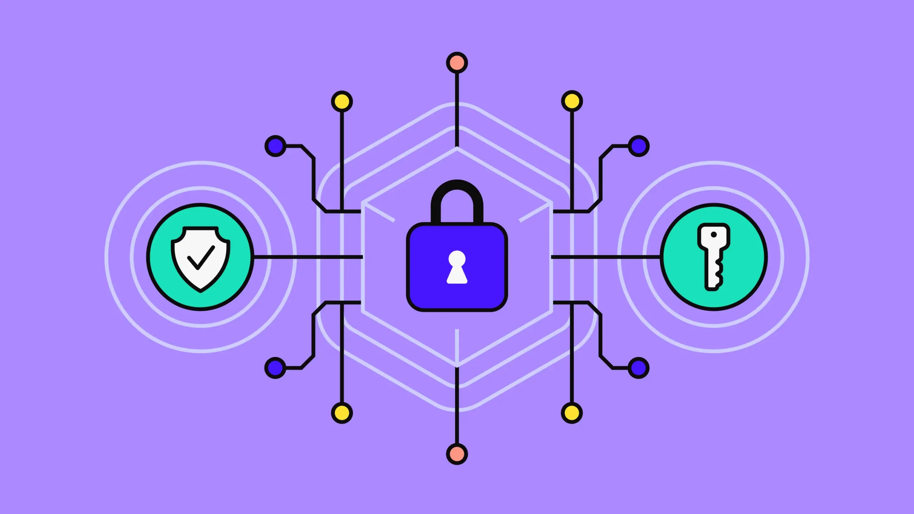
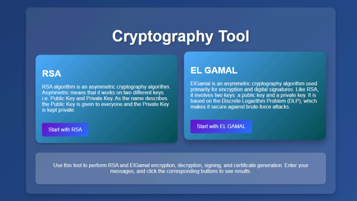
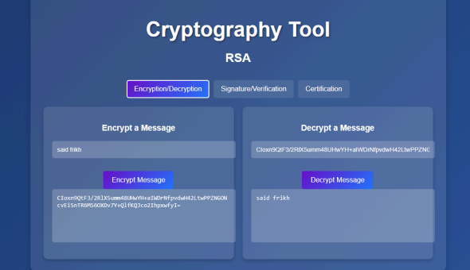
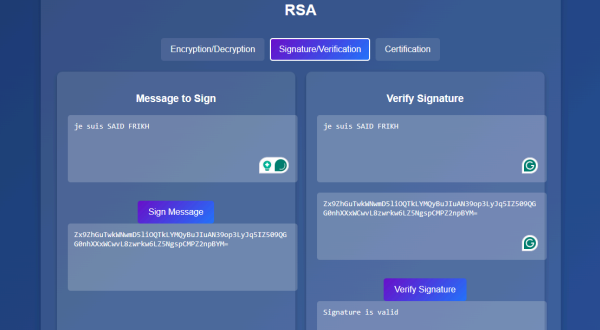
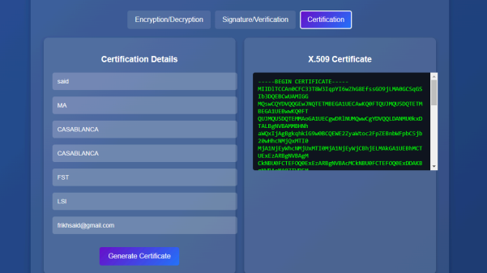
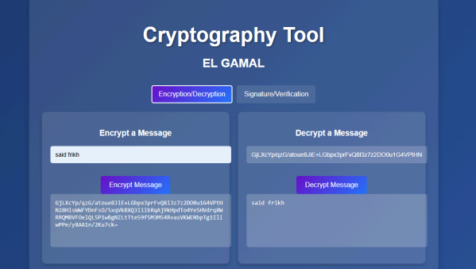
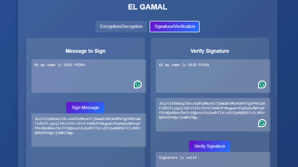

# Cryptography RSA & EL GAMAL

## 1. Introduction
Dans ce projet, nous avons implémenté deux algorithmes de chiffrement bien connus : **RSA** et **ElGamal**, en utilisant le langage Python. Ces algorithmes sont utilisés pour sécuriser les communications via des techniques de chiffrement asymétrique. De plus, nous avons ajouté la fonctionnalité de **signature numérique** et de **vérification de signature**, ainsi que la **génération de certificats** avec OpenSSL. Le tout a été exposé à travers une API Flask pour permettre l'interaction avec ces algorithmes via des requêtes HTTP.

---

## 2. Objectifs
Les objectifs de ce projet étaient de :
- Implémenter l'algorithme RSA, y compris la génération des clés, le chiffrement, le déchiffrement, la signature et la vérification de signature.
- Implémenter l'algorithme ElGamal, avec des fonctions de chiffrement, de déchiffrement, de signature et de vérification.
- Générer des certificats numériques à l'aide de la commande OpenSSL.

---

## 3. Application Web

### 3.1. Page Principale
Cette page sert d'accueil pour l'outil de cryptographie. Elle propose deux options principales : **RSA** et **ElGamal**, avec une brève introduction à chaque algorithme. Les utilisateurs peuvent cliquer sur un bouton pour commencer avec l'algorithme de leur choix. Une section d'aide explique les fonctionnalités disponibles, comme le chiffrement, la signature et la génération de certificats.

---

### 3.2. Page RSA
Cette page permet d’utiliser l’algorithme **RSA** avec des onglets dédiés :
- **Chiffrement/Déchiffrement** : Permet de chiffrer un message à l'aide de la clé publique et de le déchiffrer avec la clé privée.

- **Signature/Vérification** : Permet de signer un message avec la clé privée et de vérifier la signature avec la clé publique.

- **Génération de Certificats** : Génère des certificats X.509 en saisissant les détails requis.

**API Endpoints :**
- `POST /rsa/encrypt` : Chiffre un message avec RSA.
- `POST /rsa/decrypt` : Déchiffre un message avec RSA.
- `POST /rsa/sign` : Signe un message avec RSA.
- `POST /rsa/verify` : Vérifie la signature d'un message avec RSA.
- `POST /rsa/generate_certificate` : Génère un certificat numérique avec OpenSSL.

---

### 3.3. Page ElGamal
Cette page est dédiée à l'algorithme de cryptographie **ElGamal**. Elle inclut :
- **Chiffrement/Déchiffrement** : Saisir un message pour le chiffrer avec la clé publique et le déchiffrer avec la clé privée.

- **Signature/Vérification** : Permet de signer un message et de vérifier sa signature.

**API Endpoints :**
- `POST /elgamal/encrypt` : Chiffre un message avec ElGamal.
- `POST /elgamal/decrypt` : Déchiffre un message avec ElGamal.
- `POST /elgamal/sign` : Signe un message avec ElGamal.
- `POST /elgamal/verify` : Vérifie la signature d'un message avec ElGamal.

---

## 4. Logique Métier

### Chiffrement
1. **Entrée du message** : Le message texte est saisi par l'utilisateur via un formulaire.
2. **Génération des clés** : Une paire de clés (publique et privée) est générée dynamiquement.
3. **Chiffrement** : Le message est converti en un format chiffré à l'aide de la clé publique.
4. **Sortie du message chiffré** : Le message chiffré est renvoyé à l'utilisateur.
5. **Déchiffrement** : Le message chiffré est décrypté avec la clé privée pour récupérer le texte original.

### Signature
1. **Entrée du message** : L'utilisateur soumet un message à signer.
2. **Génération du hachage** : Un hachage du message est calculé (par exemple, avec SHA256).
3. **Signature avec clé privée** : Le hachage est signé à l'aide de la clé privée.
4. **Encodage de la signature** : La signature est encodée au format Base64 ou similaire pour faciliter son transfert.
5. **Vérification de la signature** : La signature est validée en comparant le message, la signature et la clé publique.

### Génération de Certificat
1. **Saisie des informations** : L'utilisateur fournit des données (nom, organisation, pays, e-mail).
2. **Création des clés** : Une paire de clés (publique et privée) est générée pour le certificat.
3. **Construction du certificat** : Un certificat X.509 est construit avec les informations saisies.

---

## 5. Conclusion
Ce projet a permis de mettre en œuvre les algorithmes **RSA** et **ElGamal** ainsi que de les exposer via une API Flask. Nous avons aussi appris à générer des certificats numériques avec OpenSSL et à intégrer ces fonctionnalités dans une application web. Les différentes étapes ont été bien comprises et implémentées correctement, ce qui a permis d'obtenir une solution complète pour le chiffrement, la signature et la vérification.
